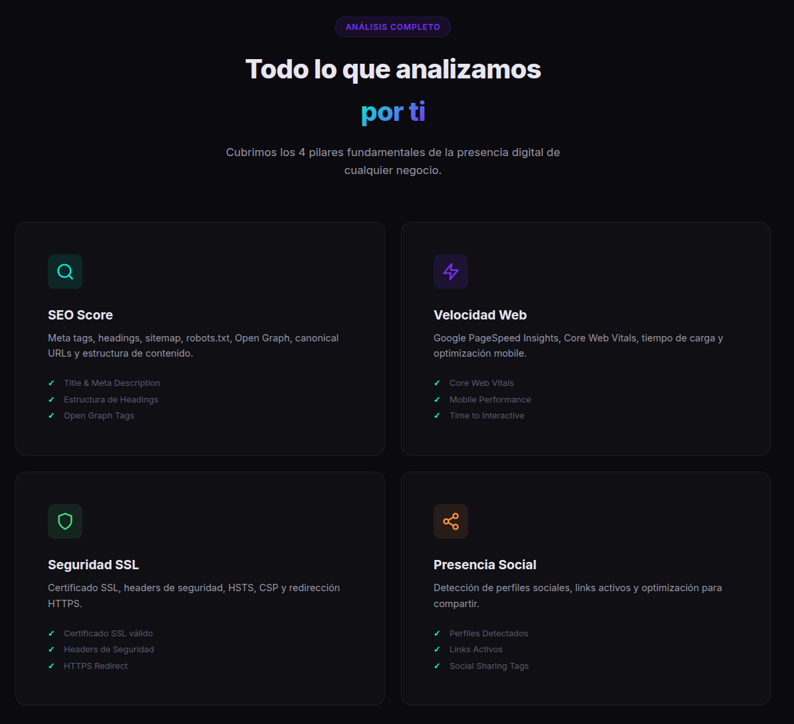
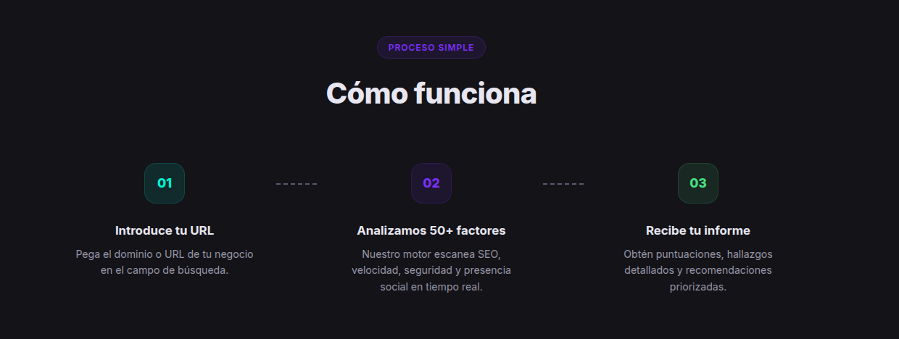

<div align="center">

# ◈ AuditPro

**Herramienta de auditoría de presencia digital para PYMEs**

Un SaaS tool que analiza cualquier sitio web en 30 segundos, evaluando **65+ factores** de SEO, rendimiento, seguridad y presencia en redes sociales, generando un informe profesional con recomendaciones accionables.


</div>

---


## 🎯 El Problema

Las PYMEs no saben cómo se ve su negocio en Internet. Pagar una auditoría de marketing digital cuesta cientos de euros y semanas de espera. Necesitaba algo que hiciera esto en segundos, de forma automática, y con recomendaciones que cualquier persona pueda entender.

## 💡 La Solución

Construí **AuditPro** — un motor de auditoría web completo que combina **web scraping, análisis SSL en tiempo real, integración con Google PageSpeed Insights API, y detección inteligente de presencia social**, empaquetado en una interfaz premium dark mode con animaciones fluidas.

El usuario introduce una URL → en ~30 segundos recibe un informe completo con puntuaciones, hallazgos detallados y enlaces directos a guías de solución.

---

## 📸 Screenshots





---

## 🧠 Arquitectura Técnica

```
┌─────────────────────────────────────────────────────────────┐
│                     FRONTEND (Vite + Vanilla JS)            │
│  • Design system custom (CSS, 0 dependencias de UI)         │
│  • Glassmorphism + dark mode                                │
│  • Animación de escáner con 36 mensajes de progreso en vivo │
│  • Renderizado dinámico de resultados con fix links          │
└──────────────────────────┬──────────────────────────────────┘
                           │ POST /api/audit
┌──────────────────────────▼──────────────────────────────────┐
│                     BACKEND (Node.js + Express)             │
│                                                             │
│  ┌──────────┐ ┌────────────┐ ┌──────────┐ ┌──────────────┐ │
│  │ SEO      │ │ Performance│ │ Security │ │   Social     │ │
│  │ Checker  │ │  Checker   │ │ Checker  │ │   Checker    │ │
│  │ (22)     │ │   (15)     │ │  (15)    │ │    (15)      │ │
│  └────┬─────┘ └─────┬──────┘ └────┬─────┘ └──────┬───────┘ │
│       │             │             │               │         │
│       │  ┌──────────▼──────────┐  │               │         │
│       │  │ Google PageSpeed    │  │               │         │
│       │  │ Insights API       │  │               │         │
│       │  └─────────────────────┘  │               │         │
│       └─────────────┬─────────────┘               │         │
│                     │                             │         │
│           ┌─────────▼─────────────────────────────▼───┐     │
│           │       Promise.allSettled (parallel)        │     │
│           └───────────────────┬────────────────────────┘     │
│                               │                             │
│           ┌───────────────────▼────────────────────────┐     │
│           │  Score Calculator + Recommendation Engine  │     │
│           │  (weighted: SEO 30% + Perf 30% +           │     │
│           │   Security 25% + Social 15%)               │     │
│           └────────────────────────────────────────────┘     │
└─────────────────────────────────────────────────────────────┘
```

## 📊 Los 65+ Checks en Detalle

### 🔍 SEO (22 checks)
| Check | Qué analiza |
|---|---|
| DOCTYPE & Charset | Validación HTML5 correcta |
| Title Tag | Presencia, longitud óptima (50-60 chars) |
| Meta Description | Presencia, longitud para CTR (150-160 chars) |
| Heading H1 | Unicidad, presencia y contenido |
| Jerarquía H2-H6 | Estructura semántica del contenido |
| Open Graph Tags | og:title, og:description, og:image, og:url, og:type |
| Twitter/X Card | Configuración para social sharing en X |
| URL Canónica | Prevención de contenido duplicado |
| Meta Viewport | Mobile-friendliness |
| Atributo Lang | Idioma declarado para Google |
| Alt en Imágenes | % de imágenes con texto alternativo |
| Datos Estructurados | JSON-LD / Schema.org con detección de tipos |
| Favicon | Presencia y ruta |
| Meta Robots | Detección de bloqueos (noindex/nofollow) |
| Estructura de URL | Limpieza y profundidad |
| Word Count | Contenido suficiente para SEO (300+ palabras) |
| Links Internos/Externos | Distribución y navegación |
| Sitemap.xml | Presencia y validez XML |
| Robots.txt | Presencia, validez y detección de bloqueos |
| Hreflang | Internacionalización multi-idioma |
| Ratio Texto/HTML | Balance contenido vs código |

### ⚡ Rendimiento (hasta 15 checks)
- **Core Web Vitals**: FCP, LCP, TBT, CLS (via Google PageSpeed Insights API)
- Speed Index, Time to Interactive
- Recursos de bloqueo de renderizado (CSS/JS)
- Optimización de imágenes (WebP/AVIF)
- Lazy loading, Font-display, Minificación
- Preconnect hints, Redirects, Peso total
- Compresión gzip/brotli, Cache-Control, HTTP/2
- Modo fallback automático si la API no responde

### 🛡️ Seguridad (15 checks)
- **SSL**: Validez del certificado + días hasta expiración + emisor
- Redirect HTTP→HTTPS forzado
- **Headers**: HSTS, X-Frame-Options, X-Content-Type-Options, CSP, X-XSS-Protection, Referrer-Policy, Permissions-Policy
- Detección de contenido mixto (HTTP en HTTPS)
- Server information disclosure (Server, X-Powered-By)
- Cookie security flags (Secure, HttpOnly, SameSite)
- CORS misconfiguration

### 🔗 Presencia Social (15 checks)
- Detección en **10 plataformas**: Facebook, Instagram, Twitter/X, LinkedIn, YouTube, TikTok, Pinterest, GitHub, WhatsApp, Telegram
- Open Graph completeness (5 tags)
- OG Image para social sharing
- Twitter Card configuration
- Apple Touch Icon (PWA/mobile)
- Schema.org Organization/LocalBusiness

## 🔧 Cada Check Incluye Guías de Solución

Cada problema detectado incluye un enlace directo **"🔧 Cómo solucionarlo"** que lleva a documentación oficial:
- [web.dev](https://web.dev) — Google's web performance guides
- [MDN Web Docs](https://developer.mozilla.org) — Mozilla's developer reference
- [OWASP](https://owasp.org) — Security best practices
- [Google Search Central](https://developers.google.com/search) — SEO guidelines

---

## 🛠️ Decisiones Técnicas

### ¿Por qué Vanilla JS en vez de React/Vue?
Performance y tamaño. El bundle final pesa menos de 50KB. No necesito un framework SPA completo para una interfaz de input → resultado. El design system está construido desde cero con CSS custom properties, glassmorphism, y micro-animaciones.

### ¿Por qué `Promise.allSettled` en vez de `Promise.all`?
Resiliencia. Si el checker de performance falla (la API de Google tiene rate limits), el resto de categorías siguen funcionando. El usuario siempre recibe un informe, aunque sea parcial.

### ¿Por qué Express y no Fastify/Hono?
Ecosistema maduro y estabilidad. Para un MVP que va a correr en un Intel NUC con Docker, la diferencia de rendimiento es irrelevante. Express tiene mejor soporte para middleware como `express.static` para servir el frontend en producción.

### ¿Por qué Cheerio para scraping en vez de Puppeteer?
Velocidad y recursos. Cheerio parsea HTML estático sin necesitar un navegador headless. El NUC tiene recursos limitados — no puedo levantar instancias de Chrome para cada auditoría. Para los checks que necesito (meta tags, headings, links), el HTML estático es suficiente.

---

## 🚀 Instalación

### Desarrollo local
```bash
git clone https://github.com/niconavares/AuditPro.git
cd AuditPro
npm install
npm run dev
# Frontend: http://localhost:5173
# API: http://localhost:3001
```

### Producción con Docker
```bash
docker compose up -d --build
# AuditPro: http://localhost:8090
```

### Deploy con acceso público (Tailscale Funnel)
```bash
chmod +x deploy.sh
./deploy.sh
# HTTPS automático vía Tailscale
```

---

## 📡 API Reference

### `POST /api/audit`

```bash
curl -X POST http://localhost:3001/api/audit \
  -H "Content-Type: application/json" \
  -d '{"url": "github.com"}'
```

<details>
<summary>Respuesta de ejemplo (click para expandir)</summary>

```json
{
  "url": "github.com",
  "overallScore": 71,
  "totalChecks": 57,
  "categories": {
    "seo": {
      "score": 80,
      "findings": [
        {
          "name": "Title Tag",
          "status": "warn",
          "detail": "Muy largo (326 chars). Google lo cortará.",
          "fixUrl": "https://developers.google.com/search/docs/appearance/title-link"
        }
      ]
    },
    "performance": { "score": 57, "findings": ["..."] },
    "security": { "score": 88, "findings": ["..."] },
    "social": { "score": 50, "findings": ["..."] }
  },
  "recommendations": [
    {
      "title": "Alt en Imágenes",
      "description": "15/42 (36%) sin alt text. Afecta SEO + accesibilidad.",
      "priority": "high",
      "category": "seo",
      "fixUrl": "https://web.dev/articles/image-alt"
    }
  ]
}
```

</details>

---

## 📁 Estructura del Proyecto

```
AuditPro/
├── index.html                 # SPA: landing + results dashboard
├── style.css                  # Design system custom (1200+ líneas)
├── app.js                     # Frontend logic + scan animation
├── vite.config.js             # Dev server + API proxy
├── Dockerfile                 # Multi-stage build
├── docker-compose.yml         # Production config
├── deploy.sh                  # One-click deploy script
└── server/
    ├── index.js               # Express API server
    ├── checkers/
    │   ├── seo.js             # 22 checks SEO
    │   ├── performance.js     # PageSpeed Insights integration
    │   ├── security.js        # SSL + headers + cookies
    │   └── social.js          # 10 plataformas + sharing analysis
    └── utils/
        └── scorer.js          # Weighted scoring + recommendations
```

---

## 🏗️ Stack

| Componente | Tecnología | Justificación |
|---|---|---|
| Frontend | Vanilla JS + Vite | Zero-dependency UI, <50KB bundle |
| Styling | CSS Custom Properties | Design system propio, dark mode glassmorphism |
| Backend | Node.js + Express | API REST, static file serving |
| HTML Parsing | Cheerio | Lightweight, sin headless browser |
| Performance API | Google PageSpeed Insights | Core Web Vitals oficiales |
| SSL Analysis | Node.js TLS (nativo) | Certificate inspection sin dependencias |
| Containerization | Docker (multi-stage) | Build optimizado, imagen ~150MB |
| Deploy | Docker + Tailscale Funnel | Self-hosted con HTTPS automático |

---

<div align="center">

**Construido por [Nicolás Navares](https://github.com/niconavares)**

</div>
